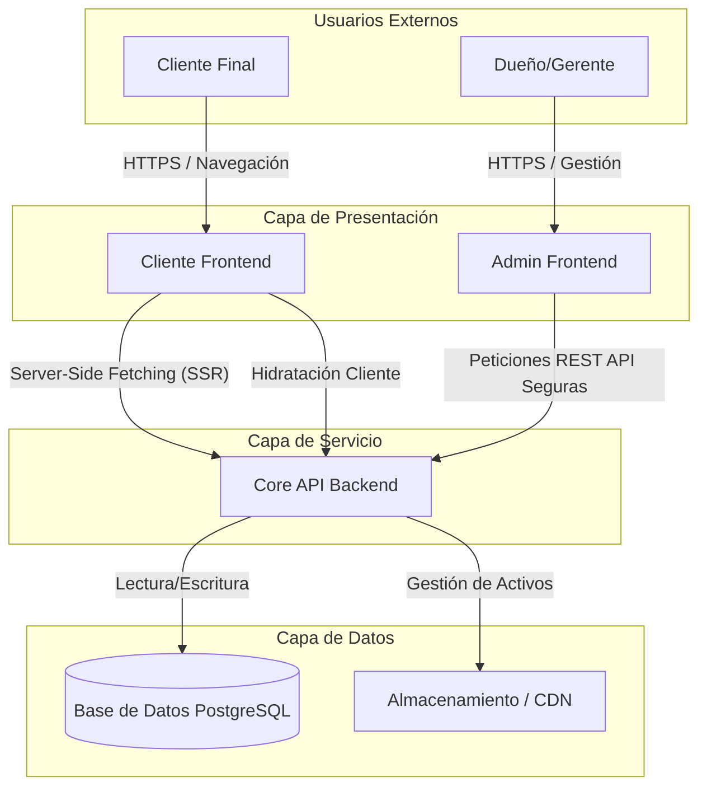

# Plataforma SaaS Multi-Tenant para Restaurantes

## 1. Resumen Ejecutivo

Este proyecto representa una solución integral de "Software as a Service" (SaaS) diseñada para automatizar el despliegue y la gestión de la presencia digital de restaurantes. El sistema emplea una arquitectura multi-tenant, permitiendo que una única instancia de despliegue sirva a múltiples marcas de restaurantes distintas con aislamiento de datos y marca visual única.

La plataforma está diseñada para alto rendimiento, Optimización de Motores de Búsqueda (SEO) y facilidad de gestión, separada en tres capas de aplicación distintas: Cliente Público, Panel Administrativo y API Backend.

## 2. Arquitectura del Sistema

El siguiente diagrama ilustra la arquitectura de contenedores de alto nivel del sistema, demostrando el flujo de datos entre los usuarios finales, los frontends de la aplicación y los servicios backend centralizados.



## 3. Resumen del Stack Tecnológico

### Cliente Público (Storefront)
*   **Framework**: Astro v5 (Server-Side Rendering) para Pintado de Contenido Inicial (FCP) y SEO óptimos.
*   **Interactividad**: Arquitectura de Islas React 19 para componentes dinámicos (Carrito de Compras, Filtros).
*   **Estilos**: Tailwind CSS v4 para sistemas de diseño utility-first.
*   **Gestión de Estado**: Nanostores para compartir estado de manera ligera y agnóstica del framework.

### Panel Administrativo (Dashboard)
*   **Framework**: React 19 (SPA) impulsado por Vite.
*   **UI/UX**: Sistema de diseño personalizado construido sobre Tailwind CSS.
*   **Formularios**: React Hook Form vinculado con Zod para validación rigurosa de esquemas.
*   **Enrutamiento**: React Router v7.

### API Backend
*   **Runtime**: Node.js.
*   **Framework**: Express.js con patrones estrictos de Monolito Modular.
*   **Lenguaje**: TypeScript para seguridad de tipos en todo el stack.
*   **Base de Datos**: PostgreSQL usando SQL puro (driver pg) dentro de un patrón Repositorio para máxima optimización y control de consultas.
*   **Seguridad**: JWT para autenticación sin estado usando estándares RSA/Bcrypt.

## 4. Configuración del Entorno de Desarrollo

Para orquestar el entorno de desarrollo completo, se deben inicializar distintos servicios. Se recomienda ejecutar cada servicio en un contexto de terminal separado.

### Prerrequisitos
*   Node.js v18 LTS o superior.
*   PostgreSQL 14 o superior (Local o Dockerizado).
*   Git para control de versiones.

### Secuencia de Inicialización

1.  **Inicialización de Base de Datos**
    Asegúrese de que PostgreSQL esté corriendo y el esquema haya sido migrado usando los scripts proporcionados en el directorio `backend/src/scripts`.

2.  **Servicio Backend**
    ```bash
    cd backend
    npm install
    npm run dev
    # El servicio escucha en el Puerto 3000
    ```

3.  **Frontend Administrativo**
    ```bash
    cd frontend-admin
    npm install
    npm run dev
    # El servicio escucha en el Puerto 5173
    ```

4.  **Frontend Cliente (Público)**
    ```bash
    cd frontend-client
    npm install
    npm run dev
    # El servicio escucha en el Puerto 4321
    ```

## 5. Estructura de Directorios

*   **/backend**: Servicios API, lógica de negocio, autenticación y repositorios de base de datos.
*   **/frontend-admin**: Single Page Application (SPA) para gestión de contenido y configuración de restaurantes.
*   **/frontend-client**: Aplicación SSR multi-tenant que sirve los sitios web públicos.
