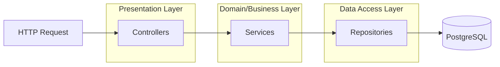
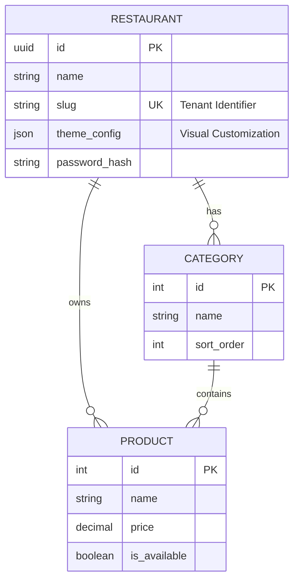

# Backend API Service

## 1. Overview

The Backend Service is the central nervous system of the SaaS platform. It is built as a RESTful API using Node.js and TypeScript, adhering strictly to **SOLID principles** and a **Layered Architecture** (Controller-Service-Repository). This design ensures separation of concerns, testability, and scalability.

It manages all data persistence, business logic validation, authentication, and file management for the ecosystem.

## 2. SaaS Architecture & Design Patterns

### Layered Architecture
The application does not couple HTTP logic with Database logic. Data flows strictly through defined layers.



*   **Controllers**: Handle HTTP input parsing, DTO validation, and response formatting. No business rules reside here.
*   **Services**: Contain the pure business logic. They orchestrate operations, handle multiple repository calls, and ensure data integrity.
*   **Repositories**: Abstract the raw SQL queries. This isolates the application from the specific database implementation details, although currently optimized for PostgreSQL.

### Database Schema (Simplified)

The following Entity-Relationship Diagram (ERD) represents the core data models supporting the multi-tenant functionality.



## 3. Technical Specifications

*   **Language**: TypeScript 5.x
*   **Runtime**: Node.js
*   **Database Integration**: `pg` (node-postgres) for direct, high-performance SQL execution.
*   **Authentication**: Stateless JWT (JSON Web Token) with Bcrypt for password hashing.
*   **Validation**: Custom validation layers ensuring data integrity before persistence.

## 4. Configuration

The application requires specific environment variables to function. These should be defined in a `.env` file in the project root.

### Environment Variables

| Variable | Description | Example |
|----------|-------------|---------|
| `PORT` | The port the server will listen on. | `3000` |
| `DB_HOST` | Database server address. | `localhost` |
| `DB_PORT` | Database server port. | `5432` |
| `DB_USER` | Database authentication user. | `postgres` |
| `DB_PASSWORD` | Database authentication password. | `secure_password` |
| `DB_NAME` | Name of the logical database. | `restaurant_saas` |
| `JWT_SECRET` | Cryptographic key for signing tokens. | `long_complex_string` |

## 5. API Documentation

### Authentication Module
*   `POST /api/auth/login`: Authenticates a restaurant admin and returns a JWT Bearer token.

### Restaurant Module
*   `GET /api/restaurant/me`: Retrieves the profile of the currently authenticated restaurant context.
*   `PUT /api/restaurant/settings`: Updates global configuration including branding, social links, and functionality toggles (Pickup/Delivery).

### Menu Module (Public Access)
*   `GET /api/menu/:slug`: This is the primary endpoint for the Frontend Client. It aggregates the Restaurant Profile, Categories, and Products into a single optimized payload to support Server-Side Rendering (SSR).

### Product Management (Private)
*   Standard RESTful CRUD endpoints (`GET`, `POST`, `PUT`, `DELETE`) used by the Admin Panel to manage the catalog.

## 6. Installation & Execution

1.  **Install Dependencies**
    ```bash
    npm install
    ```

2.  **Standard Development Mode**
    Uses `ts-node` for on-the-fly compilation.
    ```bash
    npm run dev
    ```

3.  **Production Build**
    Transpiles TypeScript to JavaScript in the `dist/` directory.
    ```bash
    npm run build
    npm start
    ```
