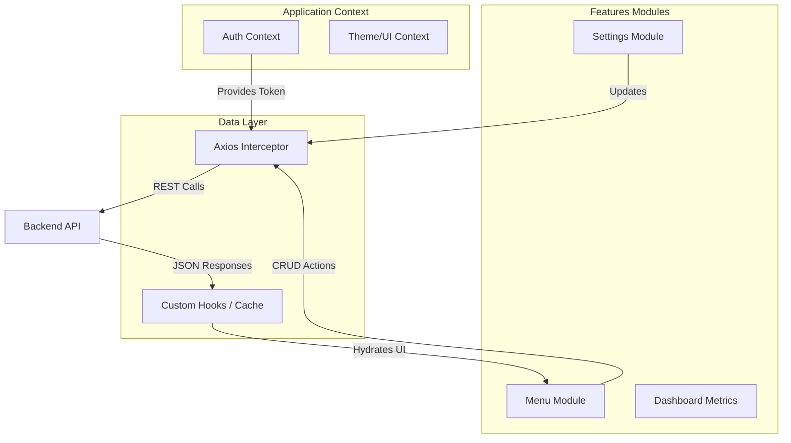

# Frontend Admin Dashboard

## 1. Overview

The Frontend Admin Dashboard is a Single Page Application (SPA) developed to provide restaurant owners with a secure, responsive, and intuitive interface for managing their digital presence. Built on **React 19** and **Vite**, it emphasizes performance, accessible form controls, and immediate visual feedback.

This application acts as the control center, allowing non-technical users to modify complex data structures (hierarchical menus, visual themes) through simple UI interactions.

## 2. Architecture & State Management

The application leverages a decentralized state management approach combined with Context API for authentication, ensuring granular re-renders and optimal performance.



### Key Components
*   **Interceptor Pattern**: A centralized Axios instance automatically injects the JWT Authorization header and handles uniform error states (401 Unauthorized, 403 Forbidden).
*   **Feature-Based Folder Structure**: The codebase is organized by domain features (`features/menu`, `features/settings`), grouping logic, components, and hooks that change together.

## 3. Technology Stack

*   **Core Framework**: React 19.
*   **Build Tool**: Vite (Rollup-based) for instant Hot Module Replacement (HMR).
*   **Language**: TypeScript (Strict Mode).
*   **Styling**: Tailwind CSS v4 with `clsx` and `tailwind-merge` for dynamic class composition.
*   **Form Management**: React Hook Form coupled with **Zod** schema validation. This ensures that no invalid data is ever submitted to the backend.
*   **Routing**: React Router DOM v7.

## 4. Key Functional Modules

### Menu Management
Provides a drag-and-drop capable interface (planned) for organizing categories and products.
*   **Product Editor**: Deep editing capabilities including image upload previews, pricing strategies, and availability toggles.
*   **Category Management**: Creation and sorting of menu sections.

### Visual Configuration (No-Code Branding)
Allows the administrator to define the visual identity of the public site without writing code.
*   **Real-time Preview**: Changes to colors, hero titles, and images are immediately reflected in the preview pane.
*   **Asset Management**: Integration for uploading and associating brand assets (Logos, Hero Images).

### Business Logic Settings
*   Toggle availability of "Pickup" or "Delivery" services.
*   Manage contact information and social media integration points.

## 5. Development Guidelines

### Setup
```bash
npm install
npm run dev
```

### Linting & Code Quality
The project enforces strict linting rules using ESLint and TypeScript configuration.
```bash
npm run lint
```
*   **No `any`**: The use of the `any` type is strictly forbidden.
*   **Component Purity**: Components should remain pure and side-effect free where possible, delegating logic to custom hooks.
