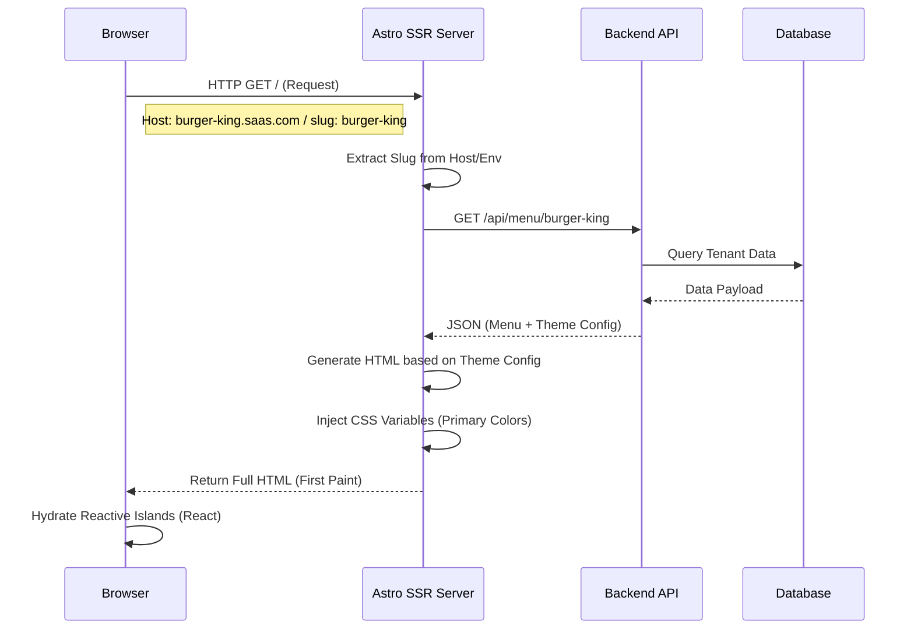

# Frontend Public Client

## 1. Overview

The Frontend Public Client is the consumer-facing interface of the SaaS platform. It is engineered using **Astro v5**, employing a **Server-Side Rendering (SSR)** strategy to deliver exceptional performance, Core Web Vitals scores, and SEO optimization.

Unlike traditional SPAs, this application ships zero JavaScript by default, hydrating only specific interactive "Islands" (ShoppingCart, Image Sliders) as needed. This architecture is critical for mobile retention and conversion rates in the food service industry.

## 2. Multi-Tenant Architecture & SSR Flow

The application is designed to be a "Chameleon," changing its entire data context and visual theme based on the incoming request context.



### Dynamic Theming Engine
The system utilizes CSS Variables (Custom Properties) injected at the layout root during the Server-Side Render phase.
*   `--primary-color`: Derived from the API response.
*   `--hero-overlay`: Calculated based on theme configuration.

This allows a single deployment artifact to serve hundreds of distinct visual identities without rebuilding.

## 3. Technology Stack

*   **Meta-Framework**: Astro v5 (Adapter: Node.js/Vercel).
*   **UI Library**: React 19 (Used strictly for interactive components via Astro Islands).
*   **State Management**: Nanostores. This library allows state to be shared between independent React islands and even Vanilla JS scripts without a heavy global wrapper.
*   **Styling**: Tailwind CSS v4.
*   **Animations**: Framer Motion (for complex UI transitions) and CSS native transitions.

## 4. Performance Optimization Strategies

1.  **Partial Hydration**: Static content (Footer, Text, Images) is never hydrated. Only components requiring user input (e.g., `AddToCartButton`) load JavaScript.
2.  **Image Optimization**: Utilization of modern formats (WebP/AVIF) and explicit sizing to prevent Cumulative Layout Shift (CLS).
3.  **Resource Inlining**: Critical CSS is inlined to unblock the main thread rendering.

## 5. Setup & Environment

### Environment Variables
Variables required to connect to the backend and simulation of multi-tenancy in local development.

```env
API_URL=http://localhost:3000/api
PUBLIC_TENANT_SLUG=burger-king-clone
```

### Execution
```bash
npm install
npm run dev
# Accessible at http://localhost:4321
```

For production simulation:
```bash
npm run build
node ./dist/server/entry.mjs
```
